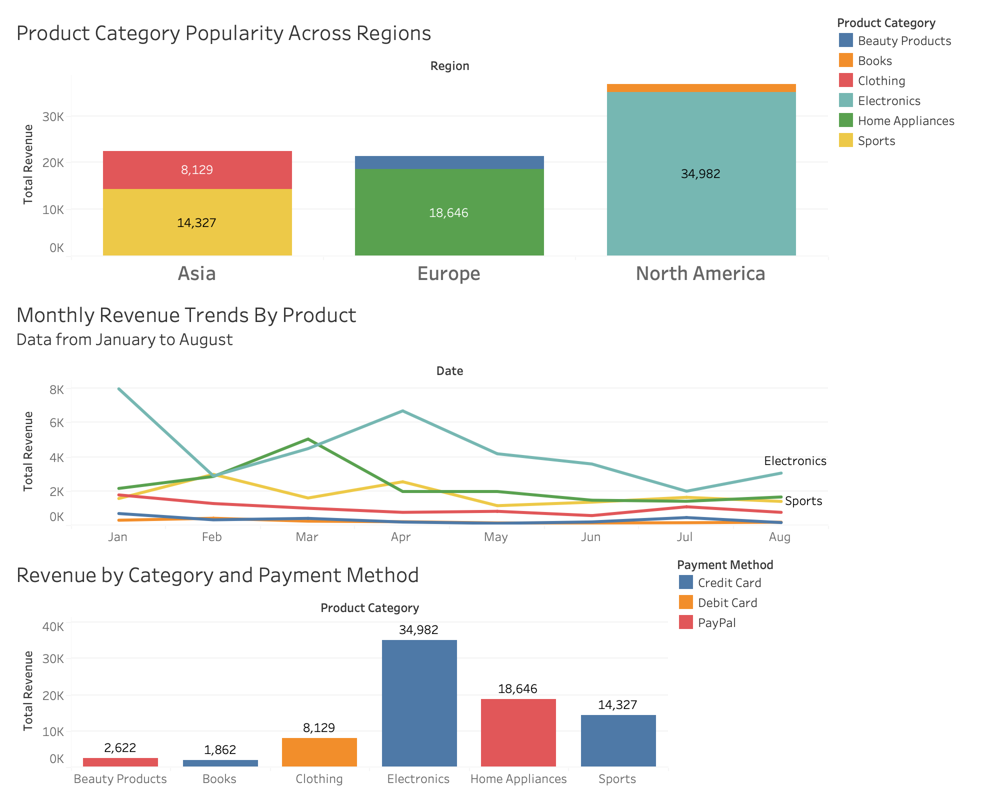

#  Nancy Uwera – Data Portfolio
Welcome to my data portfolio!  I'm Nancy Uwera, a passionate data analyst with a strong background in machine learning, data analysis, and data visualization. I’m currently pursuing a Master’s in Analytics at Harrisburg University with a focus on predictive modeling and business problem-solving. My expertise includes Python, R, SQL, and Tableau, and I’m dedicated to transforming complex data into actionable insights to drive business success.
## About Me
Strong foundation in statistical analysis, predictive modeling, and data visualization

Experienced in analyzing large datasets to uncover patterns and trends

Focused on solving business problems using data-driven insights

Interested in machine learning, business intelligence, and process optimization
## Skills and Tools
#### Programming: Python, R, SQL
#### Data Analysis: Pandas, NumPy, Scikit-learn, Seaborn, Matplotlib
#### Data Visualization: Tableau, Power BI, GeoDa, ArcGIS
#### Modeling: Predictive modeling, Hypothesis testing, Machine learning
#### Other: SAS, Microsoft Excel, EDA (Exploratory Data Analysis)
## Projects
### Sleep Disorders Analysis (R)
Cleaned and analyzed sleep disorder data using R and SQL, improving data integrity by 80%.
Built and validated multiple linear regression models to quantify the impact of sleep health and lifestyle factors.
Achieved a predictive accuracy of 90%, with a correlation coefficient accuracy of 95%.
Delivered actionable insights to improve sleep health strategies.
### Employee Performance and Attrition Analysis (Python)
Analyzed HR data to identify trends in employee satisfaction and performance.
Used Python libraries (Pandas, NumPy, Seaborn) to clean and visualize the data.
Built and tested predictive models, including a Random Forest Classifier, which achieved 98% accuracy in predicting employee attrition.
Created detailed heatmaps and distribution plots to support HR decision-making.
###  Heart Disease Prediction (Python)
Used a Kaggle dataset to predict heart disease risk using machine learning.
Conducted preprocessing and feature selection using over 20 features.
Selected Gradient Boosting as the optimal model for its high accuracy.
Created heatmaps and geospatial visualizations in Tableau to illustrate heart disease prevalence across U.S. states.
### Sales Performance Dashboard (Tableau)
Developed an interactive Tableau dashboard to analyze sales performance across product categories and regions.
Highlighted key trends in product sales, payment methods, and regional differences.
Provided insights to optimize sales strategy and boost revenue.

## Professional Experience
### Production Lead – Farmbox Greens (Seattle, WA)
Managed crop performance and inventory tracking using Excel and SQL, increasing yield by 15%.
Optimized planting schedules, reducing delays by 30%.
Created data-driven reports to improve growing conditions and reduce plant disease by 20%.
### IT Technical Support – Huskertech (Lincoln, NE)
Resolved hardware and software issues, reducing IT support tickets by 20%.
Improved network infrastructure, increasing data transfer speeds by 30%.
Enhanced system performance and data security through backup and recovery plans.
## What I'm Working On Now
Exploring predictive modeling in healthcare and business operations
Improving data visualization techniques using Tableau and Power BI
Building more machine learning models to enhance forecasting accuracy
accuracy
## Connect With Me

Email: nan.uwera@gmail.com

LinkedIn: linkedin.com/in/nuwera2

GitHub: github.com/nuwera2

Feel free to explore my projects, provide feedback, and connect! 

